# *YINGWEN*

YINGWEN app was build in order to ease the struggles that Chinese students experience daily. Since Chinese children are not allowed to study English besides school facilities nowadays, they have to attain tons of information for a short period by themselves. This app will help them to learn English and get the highest grades in their final exams. YINGWEN app is mainly aimed at enhancing English skills and passing the final English exams at primary and middle schools.

The site can be accessed by this [link](https://iuliiakonovalova.github.io/flash_cards/)

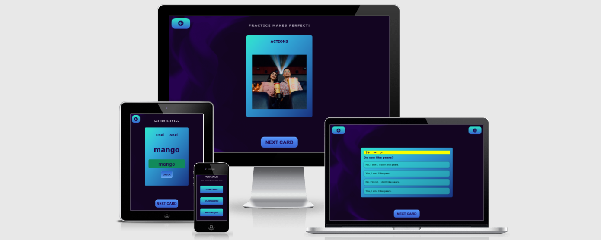

---
## User Stories

### First Time Visitor Goals:

* As a First Time Visitor, I want to easily understand the main purpose of the app, so I can learn more about this app.
* As a First Time Visitor, I want to be able to easily navigate through the app, so I can find the content.
* As a First Time Visitor, I want to engage in learning, so I can boost my knowledge in English.

### Returning VisitorGoals:

* As a Returning Visitor, I want to see various quiz, so I can practice different skills in English.
* As a Returning Visitor, I want to access information at one click, so I can learn at my own pace.

### Frequent Visitor Goals:
* As a Frequent User, I want to get constant access to learning materials, so I can continue learning.
* As a Frequent User, I want to have different options for studying, so I can develop my English skills. 

## Features

+ ### Menu Page

    - Represent: 

        * the main goal of the application.
        * Emphasize the the easiness of the using the application.
        * Provides options for learning.

    

    - Menu page has 3 buttons:

        1. Flash Cards Button leads to the page where the user can learn and practice English vocabulary;

        1. Grammar Quiz Button leads to the page where the user can learn and practice English grammar;

        1. Spelling Quiz Button leads to the page where the user can practice spelling of English words.
​
---

+ ### Flash Cards Page

    - It has a button at the top left corner of the screen, which leads to the menu page;

    - It has Flash Cards, which consist a word's topic and a descriptive picture of word;

    - It has a button, which replace the current word with another one; 

    

    - After clicking on the card:  

        - Card has the key word, IPA of the word, and sound buttons, which allow the user to listen to the correct American and British pronunciation of the word:

    

---

+ ### Grammar Quiz Page

    - It has a button at the top left corner of the screen, which leads to the menu page;

    - It has a button at the top right corner of the screen, which opens modal window with instructions for the quiz;

    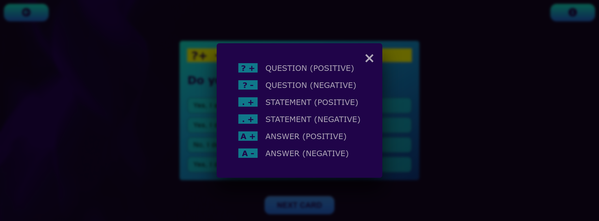

    - It has a card with a question and a grammar task;
    
    - It has 4 probable answers for the question;
    
    - It has a button and the card to go to another question;

    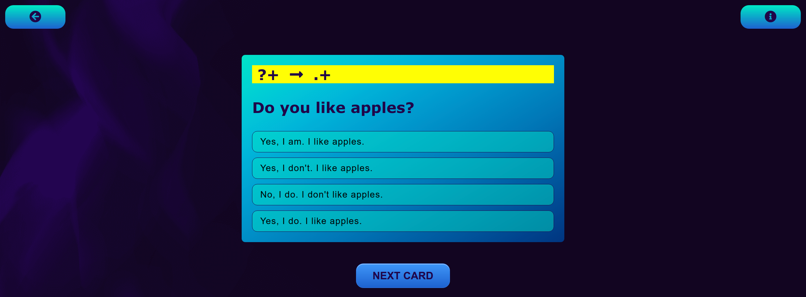

    - When the user click on the right answer, the answer's background color changes to green:

    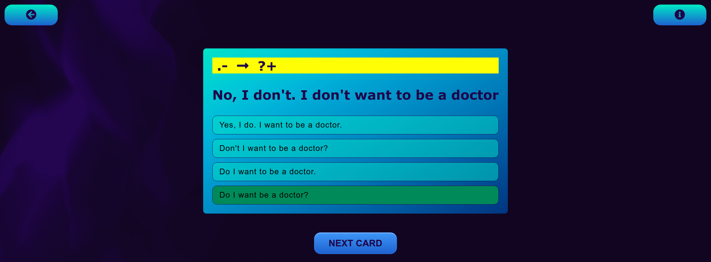

    - When the user click on the wrong answer, the answer's background color changes to ligh-pink, but the user allowed to find the correct answer anyway:

    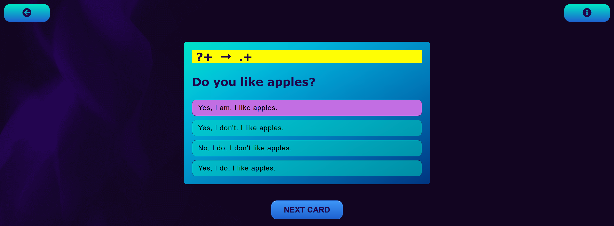

---

## Validator testing
+ ##### HTML
    - No errors or warnings were found when passing through the official W3C validator.
      - Menu Page:
          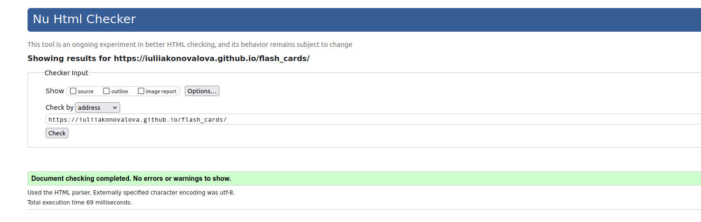
      - Card Page:
          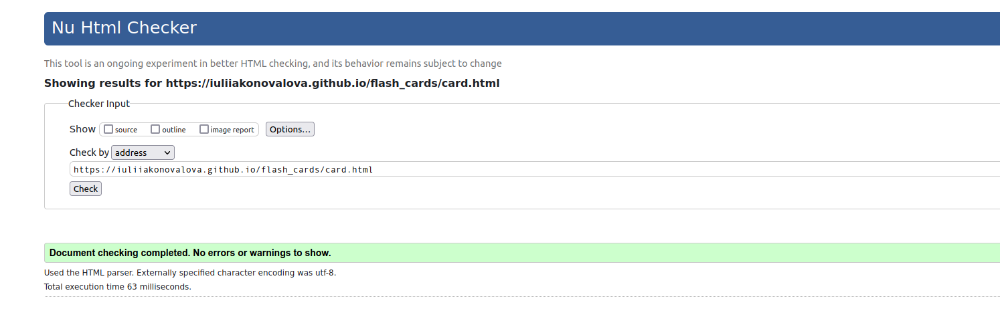
      - Grammar Quiz:
          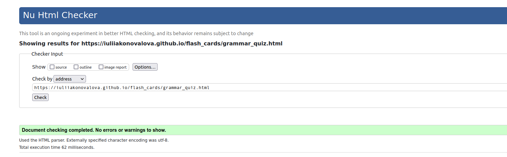
      - Spelling Quiz:
          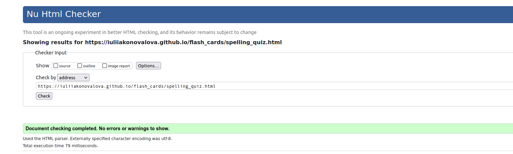
    
+ ##### CSS
    - No errors or warnings were found when passing through the official W3C (Jigsaw) validator except the warnings that all: 
      - Menu Page:
      - Cards Page:
      - Grammar Quiz:
      - Spelling Quiz:

+ ##### JS
    - No errors or warnings were found when passing through the official Jshint validator except the warnings that all: 
      - Menu Page:
      - Cards Page:
      - Grammar Quiz:
      - Spelling Quiz:

+ ##### Accessibility and performance 
    - Using lighthouse in devtools I confirmed that the website is performing well, accessible and colors and fonts chosen are readable.
      - Menu Page:
          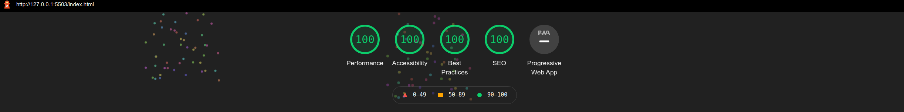
      - Cards Page:
          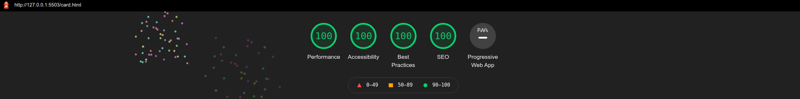
      - Grammar Quiz:
          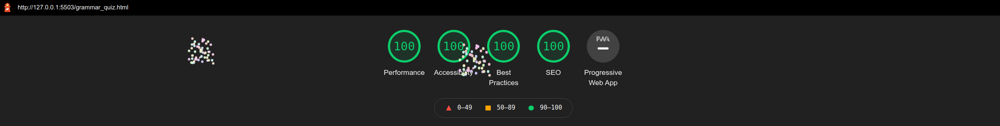
      - Spelling Quiz:
          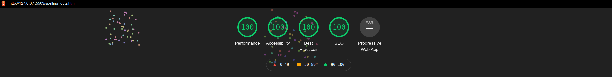

