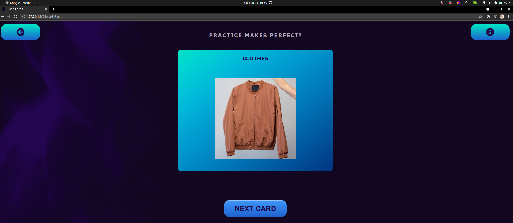
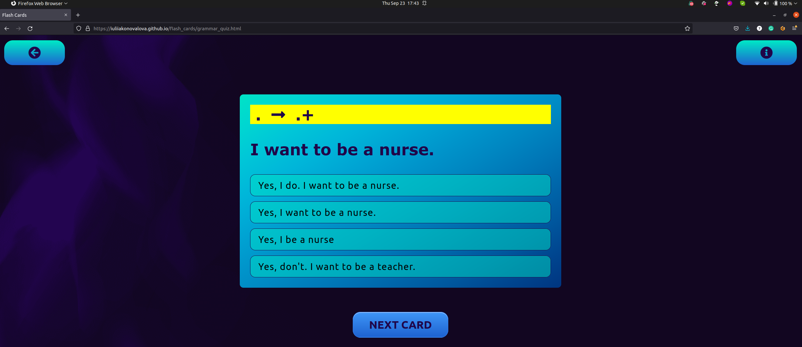
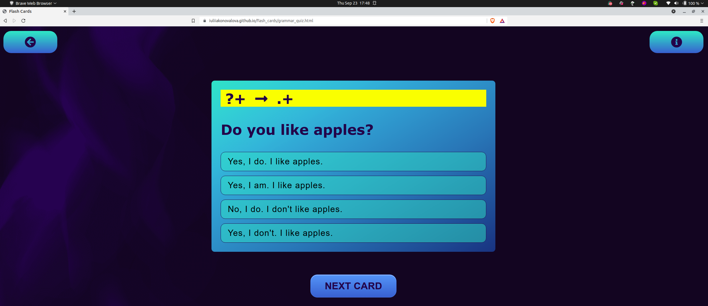

# *YINGWEN*

YINGWEN app was build in order to ease the struggles that Chinese students experience daily. Since Chinese children are not allowed to study English besides school facilities nowadays, they have to attain tons of information for a short period by themselves. This app will help them to learn English and get the highest grades in their final exams. YINGWEN app is mainly aimed at enhancing English skills and passing the final English exams at primary and middle schools.

The site can be accessed by this [link](https://iuliiakonovalova.github.io/flash_cards/)

---
## User Stories

### First Time Visitor Goals:

* As a First Time Visitor, I want to easily understand the main purpose of the app, so I can learn more about this app.
* As a First Time Visitor, I want to be able to easily navigate through the app, so I can find the content.
* As a First Time Visitor, I want to engage in learning, so I can boost my knowledge in English.

### Returning VisitorGoals:

* As a Returning Visitor, I want to see various quiz, so I can practice different skills in English.
* As a Returning Visitor, I want to access information at one click, so I can learn at my own pace.

### Frequent Visitor Goals:
* As a Frequent User, I want to get constant access to learning materials, so I can continue learning.
* As a Frequent User, I want to have different options for studying, so I can develop my English skills. 

## Features

+ ### Menu Page

    - Represent: 

        * the main goal of the application.
        * Emphasize the the easiness of the using the application.
        * Provides options for learning.

    

    - Menu page has 3 buttons:

        1. Flash Cards Button leads to the page where the user can learn and practice English vocabulary;

        1. Grammar Quiz Button leads to the page where the user can learn and practice English grammar;

        1. Spelling Quiz Button leads to the page where the user can practice spelling of English words.
​
---

+ ### Flash Cards Page

    - It has a button at the top left corner of the screen, which leads to the menu page;

    - It has Flash Cards, which consist a word's topic and a descriptive picture of word;

    - It has a button, which replace the current word with another one; 

    

    - After clicking on the card:  

        - Card has the key word, IPA of the word, and sound buttons, which allow the user to listen to the correct American and British pronunciation of the word:

    

---

+ ### Grammar Quiz Page

    - It has a button at the top left corner of the screen, which leads to the menu page;

    - It has a button at the top right corner of the screen, which opens modal window with instructions for the quiz;

    

    - It has a card with a question and a grammar task;
    
    - It has 4 probable answers for the question;
    
    - It has a button and the card to go to another question;

    

    - When the user click on the right answer, the answer's background color changes to green:

    

    - When the user click on the wrong answer, the answer's background color changes to light-pink, but the user allowed to find the correct answer anyway:

    

---

+ ### Spelling Quiz Page

    - It has a button at the top left corner of the screen, which leads to the menu page;

    - It has a card with a an audio question;

    - Card has 2 sound buttons -  allows the user to listen to American and British pronunciation in order to guess the right word:
    
    - It has input where the user can type his or her guess;

    - It has a check button to check whether the spelling of the user was correct;

    - It has a button at the bottom, which leads to another audio task:

    
    
    - When the user the spelling of the word is correct, the input background color changes to green and the user can see the original word;

    

     When the user the spelling of the word is wrong, the input background color changes to pink and the user can see the original word;

    

---

## Flowchart

The flowchart represent the logic of the application:

  

---

## Design

Deep Dark Purple Color was used to reduce visual pressure for the user.

Soft blue color was used as the main color for educational content due to its psychological effect: help the user to calmly concentrate on the question.

Dark Purple color was used to increase the contrast between the background and the text and boost the readability of the content.

Soft pinkish color was used for the title and call to action content in order to attract more user's attention toward educational content.

Yellow Color was used to highlight the task in the grammar quiz question in order to draw user's attention how to answer the question.

Light Blue Color was used as a background color of the input in order to calm down the user as he or she is about to answer question since this color creates a sense of tranquility.

Soft Green Color was used to highlight the correct answer in quiz.

Soft Pink Color was used to highlight the wrong answer in quiz, but at the same time reduce psychological pressure on the user.

'Segoe UI' (Tahoma, Geneva, Verdana, sans-serif) Font was used as the main font of the application in order to increase readability of the content on the pages.

---

## Testing

**COMPATIBILITY:**

+ The app was tested on the following browsers: Chrome, Firefox, Brave, Edge:

  - Chrome:

  
  
  
  
  
  
  - Firefox:

  
  
  
  
  

  - Brave:

  
  
  
  
  

  - Edge:

  
  
  
  
  

  - Noted Issues:
    - The Speech Synthesis does not work on Brave browser;
    - vw does not work properly in Edge browser;
+ The app was checked by devtools implemented on Firefox and Chrome browsers.
+ The app was checked with [Responsive Website Design Tester](https://responsivedesignchecker.com/).
+ The functionality of the links in the app was checked as well by different users.

---
## Validator testing
+ ##### HTML
    - No errors or warnings were found when passing through the official W3C validator.
      - Menu Page:
          
      - Card Page:
          
      - Grammar Quiz:
          
      - Spelling Quiz:
          
    
+ ##### CSS
    - No errors or warnings were found when passing through the official W3C (Jigsaw) validator except the warnings that all: 

    
    

+ ##### JS
    - No errors or warnings were found when passing through the official JSHint validator except the warnings that all: 

      - Cards:
          

      - Grammar Quiz:
          

      - Spelling Quiz:
          

+ ##### Accessibility and performance 
    - Using lighthouse in devtools I confirmed that the website is performing well, accessible and colors and fonts chosen are readable.
      - Menu Page:
          
      - Cards Page:
          
      - Grammar Quiz:
          
      - Spelling Quiz:
          

---
## Deployment

- The site was deployed to GitHub pages. The steps to deploy are as follows: 
  - In the [GitHub repository](https://github.com/iuliiakonovalova.github.io/flash_cards/), navigate to the Settings tab 
  - From the source section drop-down menu, select the **Main** Branch, then click "Save".
  - The page will be automatically refreshed with a detailed ribbon display to indicate the successful deployment.

The live link can be found [here](https://iuliiakonovalova.github.io/flash_cards/)

---

## Local Deployment

In order to make a local copy of this project, you can clone it.
In your IDE Terminal, type the following command to clone my repository:

- `git clone https://github.com/IuliiaKonovalova/animal_shelter.git`

- Alternatively, if you use Gitpod, you can [click here](https://gitpod.io/#https://github.com/IuliiaKonovalova/animal_shelter), which will start the Gitpod workspace for you.

---

## Credits

+ #### Content

  - Inspiration for the come from my friends whose children are put in tough position at schools nowadays.
  - IPA for each word was taken from [Cambridge Dictionary](https://dictionary.cambridge.org/).

+ #### Media

  - All the images for the website were taken from [Unsplash](https://unsplash.com/).
    
    + Vegetables: [artichoke](https://unsplash.com/photos/ErMaQGihZvI), [asparagus](https://unsplash.com/photos/ReXxkS1m1H0), [beet](https://unsplash.com/photos/TmjyLCUpcDY), [bell pepper](https://unsplash.com/photos/f35j-5N2N8s), [broccoli](https://unsplash.com/photos/m1t-RJ1iCIU), [brussels sprouts](https://unsplash.com/photos/dqlxphCcA2g), [cauliflower](https://unsplash.com/photos/0XVrBLy73rw), [cabbage](https://unsplash.com/photos/ZAie-pIb2fI), [carrot](https://unsplash.com/photos/qrdbYqxnets), [celery](https://unsplash.com/photos/ZugQ-1NBaO0), [chilly pepper](https://unsplash.com/photos/nZUQgW0FVnc), [coriander](https://unsplash.com/photos/9rt6gV_IjhA), [corn](https://unsplash.com/photos/taUkjCVG8Q8), [cucumber](https://unsplash.com/photos/L8GbxVUQ-f0), [eggplant](https://unsplash.com/photos/zldpdRxO_wo), [french beans](https://unsplash.com/photos/bEnSMaiHeX0), [garlic](https://unsplash.com/photos/1tcFON22sfs), [ginger](https://unsplash.com/photos/2VePbF_YRK8), [green onion](https://unsplash.com/photos/7CcXR5wIhEY), [lady fingers](https://unsplash.com/photos/CoIJlCZEjnw), [leek](https://unsplash.com/photos/KN4ampW-QOI), [lettuce](https://unsplash.com/photos/o1cMRfaYD7I), [mint](https://unsplash.com/photos/boadZKqd1YM), [mushrooms](https://unsplash.com/photos/--9pYUo2f04), [onion](https://unsplash.com/photos/0_fkPHulv-M), [peas](https://unsplash.com/photos/Sgnhru4-z78), [potato](https://unsplash.com/photos/jJUuF4hqCQM), [radish](https://unsplash.com/photos/0-vqYojpPHA),   [spinach](https://unsplash.com/photos/XlA2994Txhw), [sweet potato](https://unsplash.com/photos/geYw6L4-WU8), [tomato](https://unsplash.com/photos/OlXUUQedQyM), [turnips](https://unsplash.com/photos/jzqyx7vfmpI), [vegetables](https://unsplash.com/photos/ks5flsI1mNo), [zucchinis](https://unsplash.com/photos/T78BW9onx-I);

    + Fruits: [apricot](https://unsplash.com/photos/GtdoXDwA6Hc), [avocado](https://unsplash.com/photos/xEFoRSMT-x4), [banana](https://unsplash.com/photos/Kl3467edwsE), [berries](https://unsplash.com/photos/Qt6ojt3CacE), [blackberries](https://unsplash.com/photos/HHf5MSldFog), [blueberries](https://unsplash.com/photos/6MynOBZgig0), [cherry](https://unsplash.com/photos/INprSEBbfG4), [coconut](https://unsplash.com/photos/hL9pRezOKwc), [dragon fruit](https://unsplash.com/photos/FuJKjUONS4c), [durian](https://unsplash.com/photos/T2NJ74BKKIA), [fruits](https://unsplash.com/photos/M_xIaxQE3Ms), [grapefruit](https://unsplash.com/photos/0APQd9lx_Ck), [grapes](https://unsplash.com/photos/XIYTOBTHeaQ), [jackfruit](https://unsplash.com/photos/zEI8yxd_ktY), [kiwi (fruit)](https://unsplash.com/photos/NQvfUVkw_J8), [lemon](https://unsplash.com/photos/OuQyOqy4U_U), [lime](https://unsplash.com/photos/ZyJ_KuMlesQ), [lychee](https://unsplash.com/photos/BTX7z4dENKI), [mandarin](https://unsplash.com/photos/GvkXIndjbcE), [mango](https://unsplash.com/photos/7iLlgS5o09c), [mangosteen](https://unsplash.com/photos/R7vOeT7xc3o), [melon](https://unsplash.com/photos/EYFtic-n0Nk), [orange](https://unsplash.com/photos/ltn8ztC6kjk), [papaya](https://unsplash.com/photos/XEhf32GjdnU), [passion](fruit:https://unsplash.com/photos/dVBxFStU7kQ), [peach](https://unsplash.com/photos/jVYnBn3M9R0), [pear](https://unsplash.com/photos/haSJEJYzl5A), [persimmon](https://unsplash.com/photos/CgNEu1u27AQ), [pineapple](https://unsplash.com/photos/z0wghn-7VuQ), [plum](https://unsplash.com/photos/3eF5jFVWFjw), [pomegranate](https://unsplash.com/photos/XiWQbLEhFyo), [pumpkin](https://unsplash.com/photos/T9pdHqCsyoQ), [strawberry](https://unsplash.com/photos/xnRg3xDcNnE), [watermelon](https://unsplash.com/photos/izi5AnlbRIA), [raspberries](https://unsplash.com/photos/BTTO404UHzA);

    + Grains: [beans](https://unsplash.com/photos/hJ43iOt19qs), [buckwheat](https://unsplash.com/photos/5dhJfuTYI2g), [lentil](https://unsplash.com/photos/1PmVG-ScdKk), [oats](https://unsplash.com/photos/NfZ4133w9Kk), [rice](https://unsplash.com/photos/-LdilhDx3sk), [soybeans](https://unsplash.com/photos/y-hLxayf194), [wheat](https://unsplash.com/photos/OvUAL6Vx3uY);

    + Food: [bacon](https://unsplash.com/photos/Zaag9iLSLAU), [baguettes](https://unsplash.com/photos/xi7jtWax8qI), [barbecue](https://unsplash.com/photos/D99y38Na5Xo), [biscuits](https://unsplash.com/photos/pfsO2Eenotc), [bread](https://unsplash.com/photos/GK7v9dePZhY), [butter](https://unsplash.com/photos/094mP_CBdpM), [cake](https://unsplash.com/photos/kPxsqUGneXQ), [candies](https://unsplash.com/photos/dbOV1qSiL-c), [cereals(oatmeal)](https://unsplash.com/photos/bb2cXd5LX6Q), [chicken nuggets](https://unsplash.com/photos/e7yjYr8GxN0), [chicken wings](https://unsplash.com/photos/v_JswZL-s3k), [chips](https://unsplash.com/photos/nEZ8Zz6F7I4), [cherry pie](https://unsplash.com/photos/A2JYED-VlxA), [cheese](https://unsplash.com/photos/jeAjT87nbjM), [chocolate](https://unsplash.com/photos/H22N-9s8AUw), [crab](https://unsplash.com/photos/rXDCb-Bmgdg), [cookbook](https://unsplash.com/photos/5O1ddenSM4g), [cottage cheese](https://unsplash.com/photos/bBCRrplhhZ4), [cupcake](https://unsplash.com/photos/Ltv7a5m8i4c), [donuts](https://unsplash.com/photos/q54Oxq44MZs), [egg](https://unsplash.com/photos/5KYnLhwRO8Y), [fish](https://unsplash.com/photos/JMfP0to5obk), [fried egg](https://unsplash.com/photos/n1jhtaEHIhg), [fried chicken](https://unsplash.com/photos/3Uj0GwVmOeY), [fried fish](https://unsplash.com/photos/N8-bMqUMS8g), [hamburger](https://unsplash.com/photos/9hIJ4ZLMnZA), [honey](https://unsplash.com/photos/ZhA9vZQPTeE), [hot dog](https://unsplash.com/photos/glqTtszXfM0), [ice-cream](https://unsplash.com/photos/5A0O12BIsjY), [jam](https://unsplash.com/photos/o_O75f28GiA), [lollipops](https://unsplash.com/photos/GE92S6uxZas), [muffin](https://unsplash.com/photos/0-xIKrdFj4I), [noodles](https://unsplash.com/photos/pbc2wXbQYpI), [nuts](https://unsplash.com/photos/PHIJC0jpx9U), [oil](https://unsplash.com/photos/uOBApnN_K7w), [onion rings](https://unsplash.com/photos/HU_ubYnwElc), [pancakes](https://unsplash.com/photos/TkzdkVn1AyA), [pasta](https://unsplash.com/photos/SJ7uORconic), [pizza](https://unsplash.com/photos/oBbTc1VoT-0), [pretzel](https://unsplash.com/photos/1GeTpL5FJvY), [porridge](https://unsplash.com/photos/t-0rX27Xiy0), [popcorn](https://unsplash.com/photos/iuwMdNq0-s4), [roast chicken](https://unsplash.com/photos/BhnZwPW_tIc), [salad](https://unsplash.com/photos/EvoIiaIVRzU), [sandwich](https://unsplash.com/photos/sBKLiRiunK0), [sausages](https://unsplash.com/photos/VyHBlfvh2L4), [seafood](https://unsplash.com/photos/bdwbXwzI_Es), [shrimps](https://unsplash.com/photos/hEKN_m0qGMA), [soup](https://unsplash.com/photos/5eROVOJW2bA), [spaces](https://unsplash.com/photos/2IaZGfBKgMY), [steak](https://unsplash.com/photos/oSZ8WBaCbcg), [sweet potatoes](https://unsplash.com/photos/2s9TCIxPesI), [taco](https://unsplash.com/photos/s6SOj6uYjXI), [tofu](https://unsplash.com/photos/v-zpEVeWjy0), [waffles](https://unsplash.com/photos/1LPsUqjb_Jg);
