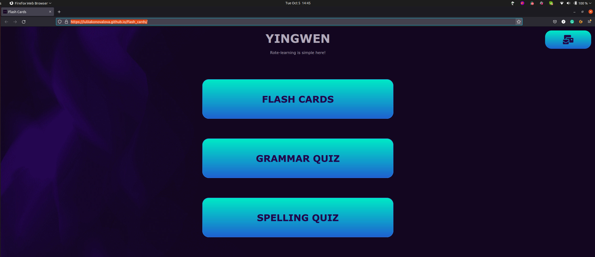
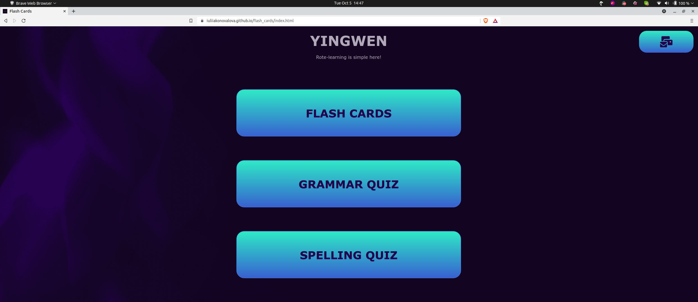
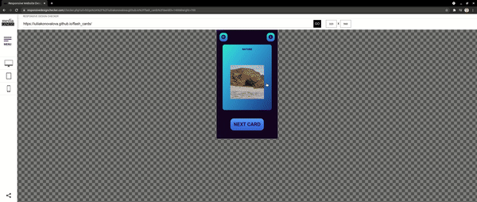
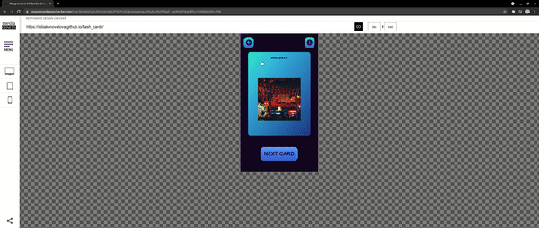
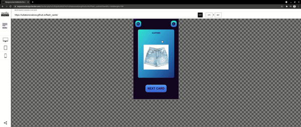
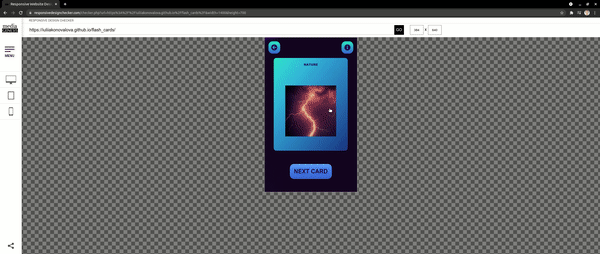
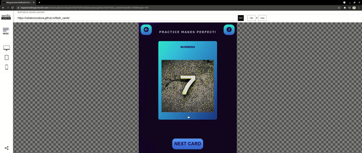
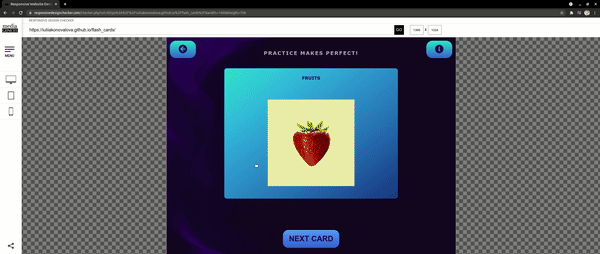
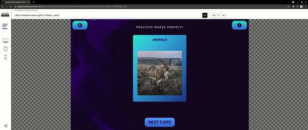
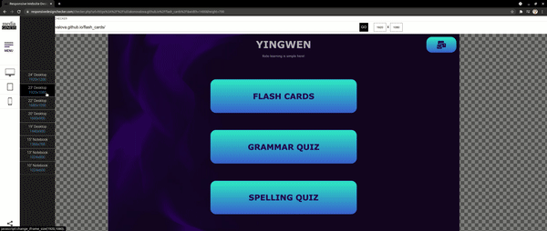

# Testing

## **COMPATIBILITY:**

+ The app was tested on the following browsers: Chrome, Firefox, Brave, Edge:

  - Chrome:

  
  
  
  
  
  
  - Firefox:

  
  
  
  
  

  - Brave:

  
  
  
  
  

  - Edge:

  
  
  
  
  

  - Noted Issues:
    - The Speech Synthesis does not work on Brave browser;
    - vw does not work properly in Edge browser;

## Devtools testing

+ The app was checked by devtools implemented on Firefox and Chrome browsers.

## Responsiveness testing

+ The app was checked with [Responsive Website Design Tester](https://responsivedesignchecker.com/).

  1. Mobile Screens:

      - Mobile 320x480:

      

      - Mobile 320x568:

      

      - Mobile 360x640:

      

      - Mobile 375x667:

      

      - Mobile 384x640:

      

      - Mobile 411x731:

      

      - Mobile 414x736:

      
      
  1. Tablets Screens:

      - Tablet 600x960:
        
      

      - Tablet 768x1024:

      

      - Tablet 800x1280:
        
      

      - Tablet 1366x1024:

      
      
  1. Desktop Screens:

      - Desktop 1024x600:
        
      

      - Desktop 1024x800:

      

      - Desktop 1366x768:
        
      

      - Desktop 1440x900:

      

      - Desktop 1600x900:
        
      

      - Desktop 1680x1050:

      

      - Desktop 1920x1080:
        
      

      - Desktop 1920x1200:

      

+ The functionality of the links in the app was checked as well by different users.

---
## Validator testing

+ ### HTML
    - No errors or warnings were found when passing through the official [W3C](https://validator.w3.org/) validator.
      - Menu Page:
          
      - Card Page:
          
      - Grammar Quiz:
          
      - Spelling Quiz:
          
    
+ ### CSS
    - No errors or warnings were found when passing through the official [W3C (Jigsaw)](https://jigsaw.w3.org/css-validator/#validate_by_uri) validator except the warnings that: root variable (  --linear-grad) could not be checked and -webkit-backface-visibility - is unknown. However, css code works perfectly. 

    
    

+ ### JS
    - No errors or warnings were found when passing through the official [JSHint](https://jshint.com/) validator except the warnings that   

      - Cards:

          

      - Grammar Quiz:

          

      - Spelling Quiz:

          

## Accessibility and performance

- Using lighthouse in devtools I confirmed that the website is performing well, accessible and colors and fonts chosen are readable.

  - Menu Page:

      

  - Cards Page:

      

  - Grammar Quiz:

      

  - Spelling Quiz:

      
